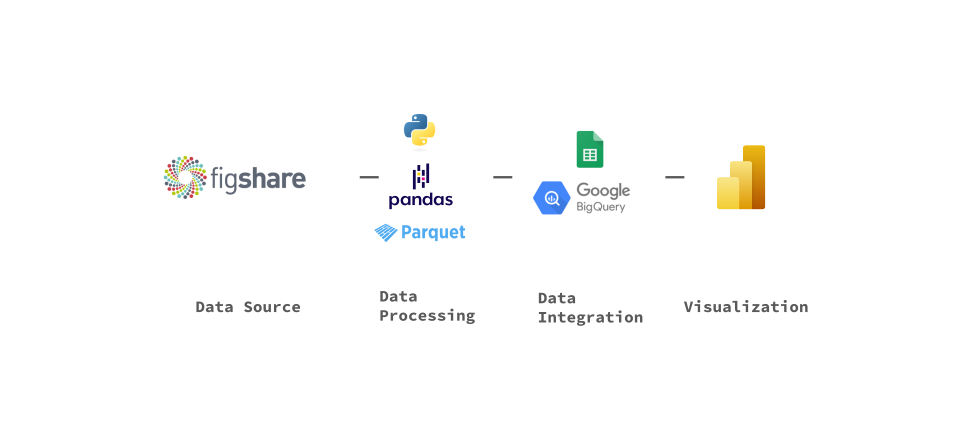
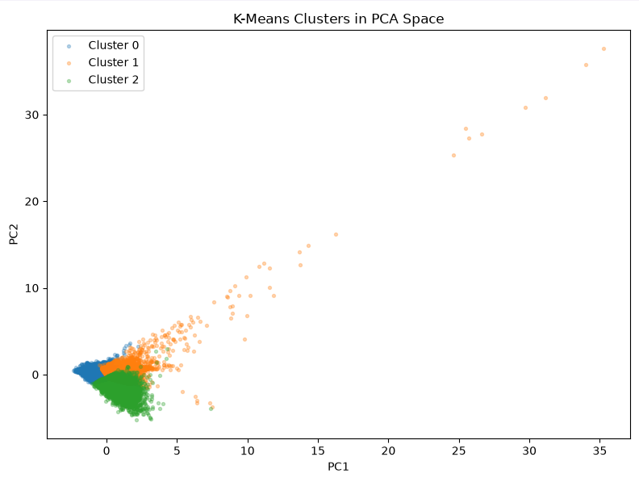

# Wearable HRV Analysis

웨어러블 센서 기반 HRV, 활동량, 수면일지 데이터를 전처리하고 분석하는 프로젝트입니다.

A data analysis project using wearable sensor data, including HRV, activity, sleep diaries, and participant surveys.

<p align="left">
  
</p>

## Tech Stack
Data Source
<br>

<br>
Data Processing
<br>

<br>
Machine Learning
<br>

<br>
Data Integration
<br>

<br>
Visualization
<br>

<br>

## Dataset
`Figshare - Springer Nature`:<br> [*In-situ wearable-based dataset of continuous heart rate variability monitoring accompanied by sleep diaries*](https://springernature.figshare.com/articles/dataset/In-situ_wearable-based_dataset_of_continuous_heart_rate_variability_monitoring_accompanied_by_sleep_diaries/28509740?file=52669388)

```text
- 49 healthy adults
- Wearable sensor data collected over approx. 4 weeks
- Daily sleep diaries
- Survey data for each participant
- `userId` in the sleep diary corresponds to `deviceId` in the sensor and survey data
```

## Data Processing

```text
1. Inspect `sensor_hrv_filtered.csv`, `sleep_diary.csv`, and `survey.csv`
2. Select columns required for analysis
3. Convert timestamps and remove invalid records
4. Save processed datasets in `Parquet` format to `data/processed`
5. Aggregate activity data by hour and day
6. Export processed datasets to CSV for external data integration
7. Generate inspection results for processed and aggregated datasets
```

```text
HR and HRV variables are preserved at the original 5-minute interval level.
Activity variables are additionally aggregated into hourly and daily datasets.
Exported CSV files are manually uploaded to Google Spreadsheets for downstream BigQuery and Power BI integration.
```

### How to run the processing pipeline

#### Git Bash / Linux

```bash
./run_pipeline.sh
```

#### Windows PowerShell

```bash
.\run_pipeline.bat
```

Both scripts execute raw data inspection, preprocessing, Parquet conversion, activity aggregation, and validation.

The Windows pipeline can also be registered with Task Scheduler:

```bash
.\register_task.bat
```

To run the registered task immediately:

```bash
schtasks /run /tn "Wearable HRV Pipeline"
```

To remove the registered task:

```bash
.\unregister_task.bat
```

## Analysis

### Daily ML Dataset
- `src/ml/prepare_ml_data.py`

Sensor, activity, sleep diary, and survey data were integrated into a daily-level ML dataset.

```text
- 1,328 rows × 21 columns
- HRV aggregated by participant and date
- Activity and sleep diary joined by date
- Survey variables joined at participant level
```

### Random Forest Regression
- `src/ml/random_forest.py`, `src/ml/random_forest_5min.py`

Random Forest models were used to explore whether sleep, activity, and sensor variables could explain RMSSD variation.

```text
- Daily RMSSD prediction showed strong participant-level baseline effects
- Test R² remained close to 0 after reducing overfitting
- Within-participant centered analysis also showed limited explanatory power
- Closely related HRV variables produced very strong predictions but added limited explanatory value
```

These results shifted the analysis focus from prediction accuracy toward exploratory analysis of physiological and sensor-state patterns.

### K-Means Clustering
- `src/ml/k_means.py`, `src/ml/k_means_final.py`

K-Means clustering was applied to 5-minute sensor data using:

```text
HR
acc_magnitude
light_avg
```

After standardization, `k=3` produced the highest silhouette score (`0.3700`).

The resulting clusters showed different heart-rate, acceleration, and light profiles. Although RMSSD and SDNN were not used to create the clusters, their values also differed across clusters.

Participant-level checks showed that most participants appeared in multiple clusters, suggesting that the clusters may represent recurring sensor states rather than simply separating individual participants.

### PCA Visualization

<p align="left">
  
</p>

PCA was applied to visualize the three-dimensional clustering feature space in two dimensions.

```text
PC1 explained variance: 36.85%
PC2 explained variance: 32.86%
Total explained variance: 69.71%
```

The PCA projection retained the overall three-cluster structure while also showing overlap between clusters, consistent with the moderate silhouette score.

PCA loadings indicated that:

```text
- PC1 was primarily associated with higher HR and light, and lower acceleration magnitude
- PC2 was primarily associated with acceleration magnitude and light
```

## Analysis Summary

```text
- Daily sleep and activity variables had limited explanatory power for RMSSD across participants
- Participant-specific HRV baselines strongly affected regression performance
- Closely related HRV variables could produce high predictive performance without providing meaningful new relationships
- K-Means identified three recurring sensor-state clusters without directly using RMSSD or SDNN
- PCA preserved approximately 69.7% of the clustering feature variance in two dimensions
```

## Project Structure

```text
data/
├─ raw/          # Raw dataset files
├─ processed/    # Processed Parquet files
├─ export/       # CSV files to export into Google Spreadsheets
└─ ml/           # ML-ready datasets

docs/            # Data inspection outputs

src/
├─ ml/           # Machine learning and clustering scripts
└─ ...           # Preprocessing and aggregation scripts

output/          # Analysis outputs

requirements.txt
set_environment
run_pipeline.sh
run_pipeline.bat
register_task.bat
unregister_task.bat
```
